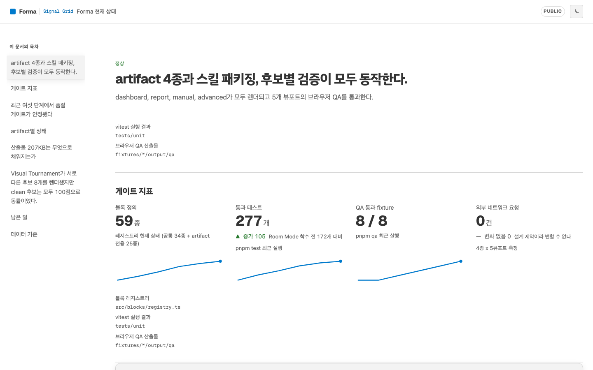
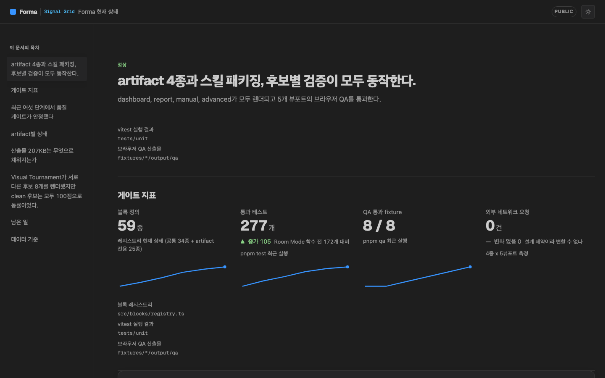
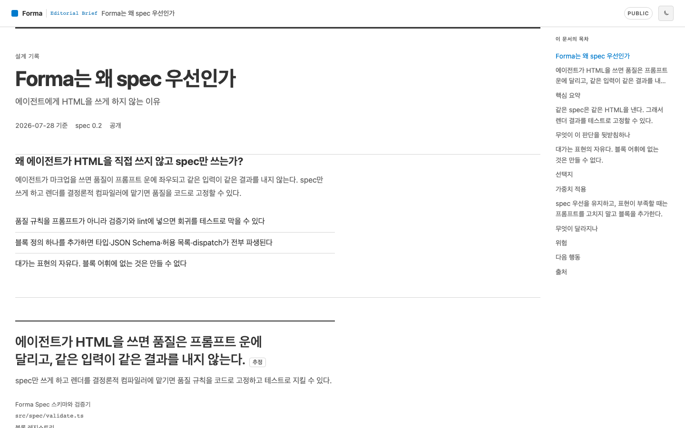
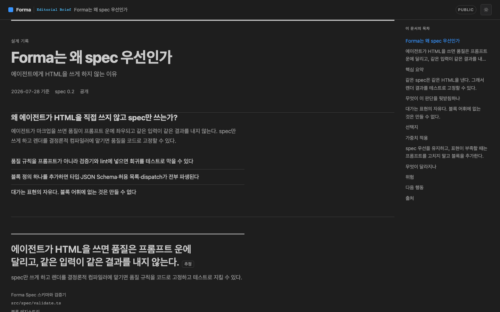
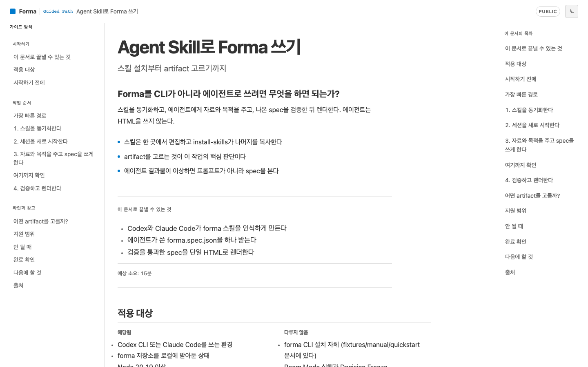
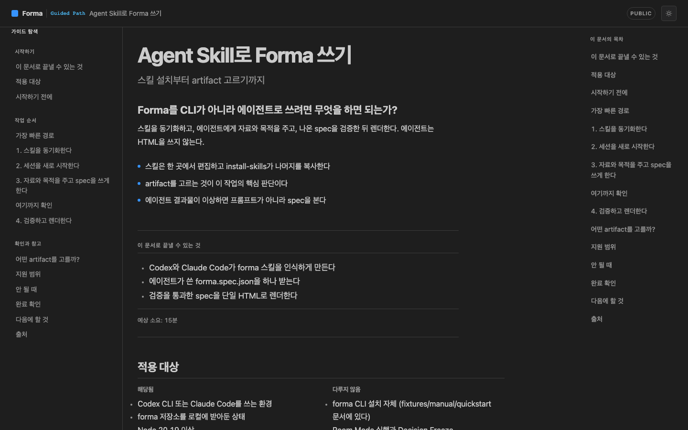
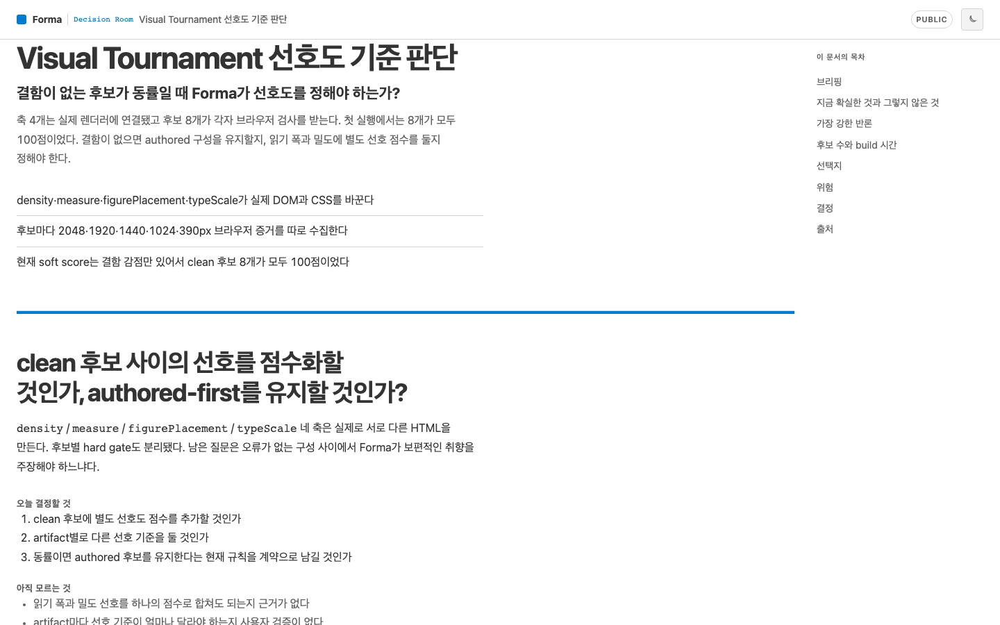
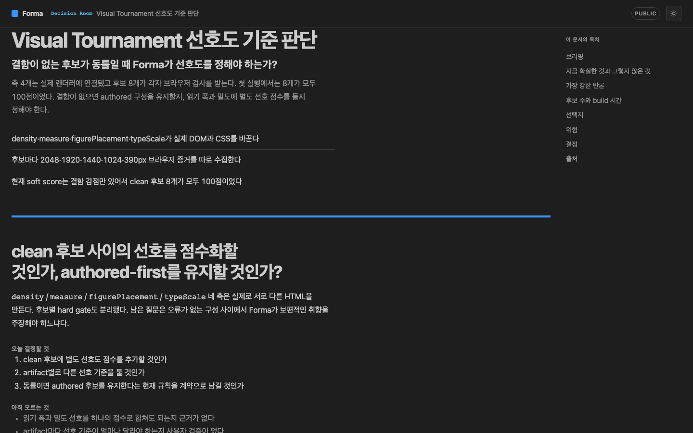

# Forma

**Forma means form: the shape that makes complex work understandable,
reviewable, and actionable.**

The name describes the product. Forma does not decorate raw content after the
fact; it gives evidence, narrative, and action a deliberate structure before
they reach the page. **Turn complex work into clear form.**

Forma gives Codex and Claude Code four Agent Skills for turning documents,
code, test results, metrics, and decision material into polished,
self-contained HTML. You ask the Agent for the outcome; the Agent reads the
source, chooses the right artifact, writes a structured spec, renders it, and
checks the result.

The output is one offline HTML file: no account, no server, no tracking, and no
external network requests.

**[Open the live HTML gallery](https://dotoricode.github.io/forma/)**
· [Visual introduction](./docs/forma-introduction/output/index.html)
· [Dashboard](https://dotoricode.github.io/forma/dashboard/)
· [Report](https://dotoricode.github.io/forma/report/)
· [Manual](https://dotoricode.github.io/forma/manual/)
· [Decision Room](https://dotoricode.github.io/forma/advanced/)

The gallery is rebuilt from the current example specs and deployed from
`main` with GitHub Pages. Every preview links to the actual self-contained
HTML, so it can be inspected in a browser instead of only as repository
source.

## Designed differently from prompt-to-HTML generators

A typical prompt-to-HTML workflow asks one model to understand the material
and invent the page at the same time. That can produce a striking first
render, but layout, hierarchy, density, and interaction are prompt-dependent.
Forma moves those visual decisions into a deterministic design system.

| Typical prompt-to-HTML workflow | Forma |
|---|---|
| Starts from an open canvas | Starts from a reader contract |
| Generates layout and CSS per request | Compiles semantic blocks through a versioned design grammar |
| Often converges on one reusable card-grid aesthetic | Uses a different composition model for metrics, arguments, procedures, and decisions |
| Visual hierarchy changes when the prompt changes | Hierarchy is owned by the artifact and remains consistent across runs |
| Judges quality mainly from the final screenshot | Checks structure, overflow, clipped text, accessibility, and offline behavior |
| The model owns both meaning and presentation | The Agent owns meaning; the renderer owns presentation |

Forma is not trying to make the most visually novel page on every run. It is
trying to make the visual form appropriate to the reader's job—and to make
that decision repeatable, inspectable, and testable.

## Four design grammars

These are sometimes called themes, but they are more than skins. Each one
changes information hierarchy, page rhythm, navigation, density, and the
semantic blocks available to the Agent. Their writing voices differ too:
operational and terse, edited and argumentative, calm and procedural, or
deliberative and explicit about uncertainty.

The light and dark modes use semantic colors mapped from VS Code's built-in
Light+ and Dark+ palettes. Blue carries interaction and primary series;
green, orange, red, purple, and cyan distinguish state and data without
turning the document into decoration. See the
[palette mapping](./docs/vscode-palette.md).

### Signal Grid · dashboard

A terse operations surface. Status, KPIs, sparklines, and comparative charts
lead the first screen; prose explains only what the visual evidence cannot.

| Light+ | Dark+ |
|---|---|
| [](https://dotoricode.github.io/forma/dashboard/) | [](https://dotoricode.github.io/forma/dashboard/) |

### Editorial Brief · report

An edited brief. It states the judgment first, then paces claims, evidence,
alternatives, and recommendations through an asymmetric editorial grid.

| Light+ | Dark+ |
|---|---|
| [](https://dotoricode.github.io/forma/report/) | [](https://dotoricode.github.io/forma/report/) |

### Guided Path · manual

A calm, imperative guide inspired by mature documentation products: grouped
navigation on the left, a wide procedure in the center, and an on-page
outline on the right. Steps name both the action and the observable result.

| Light+ | Dark+ |
|---|---|
| [](https://dotoricode.github.io/forma/manual/) | [](https://dotoricode.github.io/forma/manual/) |

### Decision Room · advanced

A facilitated decision record. Claims and counterclaims stay visibly
separate, simulations remain conditional, and dissent survives the final
recommendation.

| Light+ | Dark+ |
|---|---|
| [](https://dotoricode.github.io/forma/advanced/) | [](https://dotoricode.github.io/forma/advanced/) |

## Install in your Agent

Give your Agent one of these requests. It will clone or update Forma, prepare
the renderer, install all four skills, and verify the result by following
[`docs/agent-install.md`](./docs/agent-install.md).

### Codex

```text
Install Forma for Codex from https://github.com/dotoricode/forma.
Follow docs/agent-install.md exactly, use user scope, verify that all four
Forma skills were installed, and tell me when I need to restart Codex.
```

After restarting Codex, these skills are available:

```text
$forma-dashboard
$forma-report
$forma-manual
$forma-advanced
```

### Claude Code

```text
Install Forma for Claude Code from https://github.com/dotoricode/forma.
Follow docs/agent-install.md exactly, use user scope, verify that the Forma
plugin contains all four skills, and reload the plugins when finished.
```

After running `/reload-plugins`, these skills are available:

```text
/forma:dashboard
/forma:report
/forma:manual
/forma:advanced
```

The installation keeps a local Forma checkout as the rendering runtime. The
Agent handles the checkout, dependencies, build, host-specific packaging, and
runtime connection. If a prerequisite is missing, it reports the exact
recovery step instead of leaving a skill that cannot render.

## Use Forma

Ask for the outcome you need and point the Agent at the source material.

```text
$forma-report Review this diff for tomorrow's architecture meeting.

$forma-dashboard Turn these CI results and crash metrics into a release gate.

$forma-manual Convert the setup notes in docs/onboarding into a guide that a
new engineer can follow and verify.
```

With Claude Code, use the corresponding `/forma:report`,
`/forma:dashboard`, or `/forma:manual` command.

The Agent owns meaning, narrative, source attribution, and semantic block
selection. Forma's deterministic renderer owns layout, typography,
accessibility, sanitization, and visual consistency. The Agent never writes
the final HTML or CSS by hand.

## Choosing an artifact

Each skill represents a reader contract:

| Skill | Artifact | Use it when the reader needs |
|---|---|---|
| `dashboard` | Signal Grid | Current state, important numbers, changes, and drivers |
| `report` | Editorial Brief | A conclusion, evidence, alternatives, risks, and a recommendation |
| `manual` | Guided Path | Ordered steps, expected results, checks, and recovery |
| `advanced` | Decision Room | A group decision, counter-arguments, simulation, dissent, and a durable record |

`dashboard`, `report`, and `manual` can be selected automatically from the
request. `advanced` is explicit-invocation only because it assumes a real
decision with real stakeholders.

## What the Agent does

```text
source material
      │
      ▼
Forma Agent Skill reads, attributes, and structures the material
      │
      ▼
forma.spec.json
      │
      ▼
deterministic renderer
      │
      ▼
self-contained index.html
      │
      ▼
design, responsive, accessibility, and offline checks
```

Facts and inferences remain distinct in the spec. A claim can only be marked
`verified` when a source directly supports it. The rendered file embeds its
styles and locally subset fonts, sanitizes authored content, and makes zero
external requests.

## For contributors

The CLI is the renderer and maintainer interface used behind the Agent Skills.
It is not the primary product surface.

- [`docs/cli.md`](./docs/cli.md) — local setup, CLI commands, and quality gates
- [`DESIGN.md`](./DESIGN.md) — design-system source of truth
- [`docs/architecture.md`](./docs/architecture.md) — renderer architecture
- [`docs/agent-first-installation.md`](./docs/agent-first-installation.md) — installation design
- [`docs/security.md`](./docs/security.md) — sanitization and offline guarantees
- [`docs/product-brief.md`](./docs/product-brief.md) — product scope
- [`CHANGELOG.md`](./CHANGELOG.md) — changes and compatibility notes

## Status

MVP. All four artifacts have canonical fixtures and pass responsive,
accessibility, console, network, and design checks. Forma currently supports
Codex and Claude Code.
